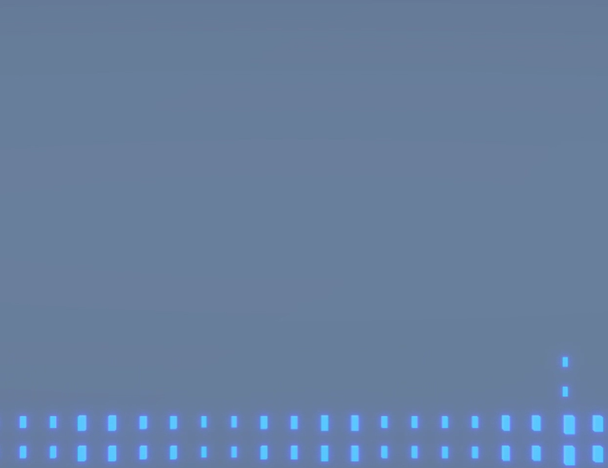
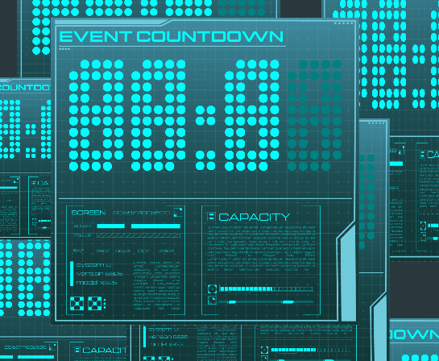

# Immersive Design Residency Katoenhuis

## 1. Introduction
### 1.1 Briefing
#### In 2 weeks time make an installation in Katoenhuis in which the visitor feels like a conductor and where the visitor follows the intensity of the piece
#### Make an 'Immersive Experience' in which visitors feel like a conductor.
Build an standalone experience that accommodates at least one visitor, but it has to be musically in sync with the other installations.  
Visually the installations are allowed to be different, so that it's fun for every visitor to try every installation.
#### Challenges
Timing is everything.  
 The light and visuals have to be timed with the audio to keep the connection of what people hear and see.  
 Visitors need to know what kind of movements fit what moments.  
 Making sure the visitors know when the music becomes more intense or calmer.  
 No latency.  

### 1.2 Goal 

The visitor needs to immediately feel like a conductor when they pick up the baton.
## Day 1/2
The first day working on this project, I set out to find out a way to set up the ZED 2i motion camera.  
However I only found out on the second day that I was using the wrong cable

### Testing 
After trying a while with the ZED i2 camera with the wrong cable, I gave up and set up a Xbox Kinect for xbox one, but while testing I discovered that the hand tracking was way too buggy to be reliable for a project.

### Hope
On the second day someone informed me that the zed 2i has a special cable and after setting it up again it worked!  
After some hardships i got to testing with the Unity samples and I found some issues with the settings after a while of debugging I got it to work and i could start with building the program the next day

## Day 3
### Issues
Having never worked with object tracking before i got a lot of issues with the tracking, so I'm going to hard switch to coding visuals based on sound.

## Day 4 
### Interaction through sound design

Using code made by teachers and and some of my own tweaking for visuals.  
After looking at the code I added values to change the shape and values to change the color.   
By making the rgb value have r on bass green on peak and blue on 1 you will get a system that can change the color of the shader I made.  
The shader uses multiply nodes to make the color more intense.

### Testing
After a little bit of testing I found out the camera in unity turns off post processing, because of that you couldnt see the emission of the color in the game scene.  
Also by flipping the shaders because i originally intended to make the plane glow i found that it had a way better effect

### Some issues
I'm not quite sure how good the visuals are based on sound because I had to use a virtual cable to test things

## Day 4/5
### Hand tracking is annoying
On day 4 I couldnt get handtracking to work due to mediapipe solutions being depricated and i asked one of my teammates to do it in touch designer
### building scenes
I finished building the [church](https://github.com/PennydeBoer/Katoenhuis/releases/tag/Church) scene and the [clock](https://github.com/PennydeBoer/Katoenhuis/releases/tag/Clock) scene, now we need to setup the projectors and crts

## Scripts

[Audio Visualizer](Katoenhuis/Assets/Scripts/AudioVisualizer.cs) | [Color changing](Katoenhuis/Assets/Scripts/ChangingLight.cs) | [Audio data tracking](Katoenhuis/Assets/Scripts/RealTimeAudioFeatures.cs) | [Cam Aspect ratio](Katoenhuis/Assets/Scripts/AspectLock.cs) | [Clock Virus](Katoenhuis/Assets/Scripts/RandomlyGeneratedTimer.cs)